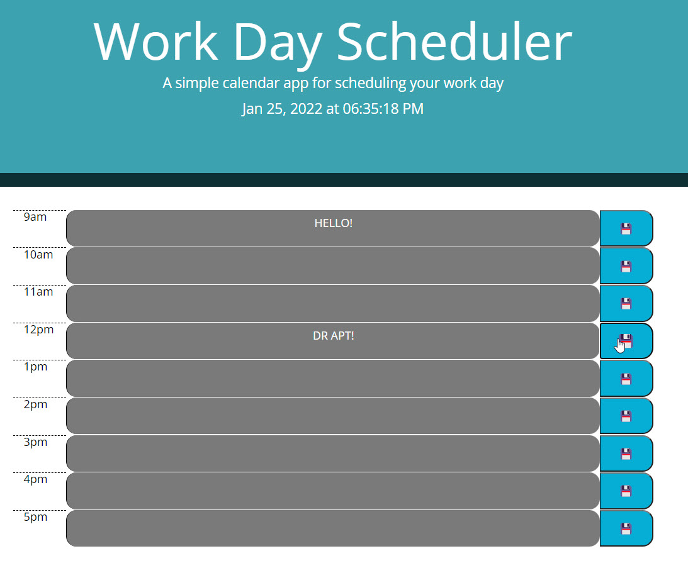

# Homework-Week5

Title: Javascript Quiz
Author: Bobby Schwartz
Description: This is my Coding Bootcamp Week 4 assignment: a scheduling client that uses Jquery, and third party API's to style and initiate effects.
created: 1/25/21

## Details
This scheduler includes hour blocks for each of the nine hours of the working day. these blocks dispaly the hour, a text field for appointment or event entry, and a save button.
The user can write in appointment info to a specific schedule block and click that block's save button to send the data to local storage. on page refresh, the data remains. 

In addition to displaying the date and local time at the top, moment.js is used to stylize the hour blocks based on past, present, and future hours.
using a simple 24-hour military time format, the script deterimines if a time block is the current hour of the day. if not - it will assign styling classes in conditionals for each hour block.
The screenshot below for example, occurs after 5pm, so all blocks are displayed as "past" grey.

### Screenshots

### Active link:
The deployed application can be viewed here:

https://robertschwartz603.github.io/Homework-Week5/
